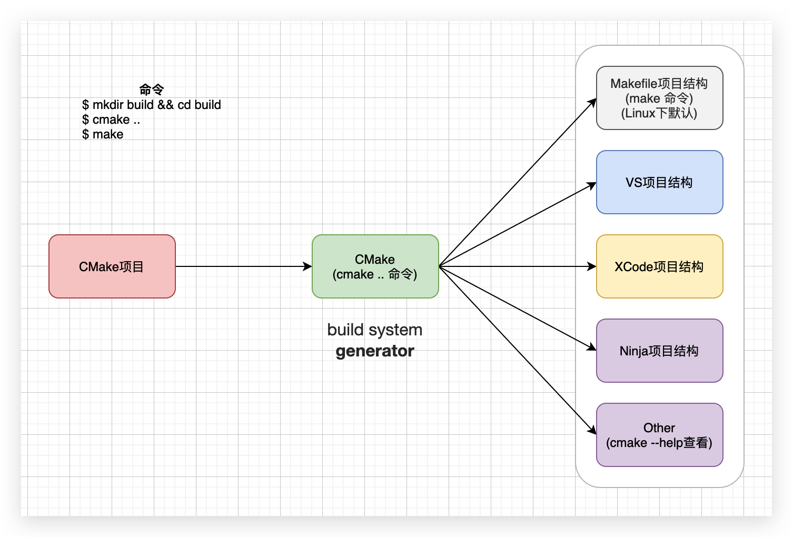

# CMake教程

## 简介

官网:https://cmake.org/

> CMake is an open-source, cross-platform family of tools designed to **build, test and package software**. CMake is used to control the software compilation process using simple platform and **compiler independent configuration files**, and **generate native makefiles** and workspaces that can be used in the compiler environment of your choice.

开源,跨平台的**构建,测试,打包**软件工具,
使用简单平台和独立于编译器的**配置文件**来控制软件编译过程, 生成可在您选择的编译器环境中使用的本机makefile和工作区

**画重点:**

* 配置文件:cmake脚本(命令/语法)
* 构建:CMake
* 测试:CTest
* 打包:CPack

## CMake是什么?

> 提供一组工具, 可以在不同平台上配置、构建、测试和部署项目. https://www.aosabook.org/en/cmake.html

CMake是一个**构建系统生成器**(build system **generator**), 不是build system

* 支持主流的build system:Make, Ninja, Visual Studio, XCode, ...
* 跨平台:Linux, Windows, OSX, ...

有大一统的趋势. 越来越多的第三方库提供 CMake 配置, 包括QT, Android NDK官方支持CMake

## Jetbrain 2020调查

* c:https://www.jetbrains.com/lp/devecosystem-2020/c/
* cpp:https://www.jetbrains.com/lp/devecosystem-2020/cpp/

**CPP:**

## 安装:

地址:https://cmake.org/download/

**CMake两个重要版本:**

* Modern CMake: CMake 3.0+
* More Modern CMake: CMake 3.12+

**命令行**版本 vs **界面**版本

界面版本都是对命令行版本的包装和可视化,这里也只讲命令行版本,cmake命令行会了,在去使用界面版本的问题不大

**其它需要安装环境:**

* 对应编译器GCC, LLVM.
* [VSCode](https://code.visualstudio.com/)及cmake插件:[CMake](https://marketplace.visualstudio.com/items?itemName=twxs.cmake), [CMake Tools](https://marketplace.visualstudio.com/items?itemName=ms-vscode.cmake-tools).

## 学习步骤:

**官方文档教程存在的问题:**

* 官方教程[CMake Tutorial](https://cmake.org/cmake/help/latest/guide/tutorial/index.html), 学习步骤顺序没有问题;问题是内容精简得,里面很多概念不会跟你解释
* CMake的[官方文档](https://cmake.org/cmake/help/latest/index.html)更像是个手册,方便查询的那种;

> 知乎某某的吐槽: 虽然官方的documentation很详细, 但特么都是描述性的。也就是说CMake告诉你他能做什么, 我有多屌, 但是他不告诉你该怎么做, 以及为什么要这么做。从而开发过程就变成了一个试错过程

无法作为一种渐进的,结构化的学习CMake的方式

### 本教程步骤:

> 从`helloworld`开始, 然后会讲一些cmake脚本中的常用命令,循序渐进,中间会穿插讲解很多概念解释

1. [helloworld示例](docs/01_helloworld.md)
2. [cmake常用脚本命令(CMakeLists.txt)](docs/02_common_script_commands.md)
3. [生成target(可执行程序/动态库/静态库)](docs/03_target.md)
4. [CMake的模块](docs/04_modules.md)
5. [项目引入三方库](docs/05_thirty_part_library.md)
6. [交叉编译](docs/06_cross_compiling.md)
7. [安装/打包](docs/07_install_pack.md)

**本教程的前提假设:**

* 你会使用gcc编译代码或项目,使用过动态库,静态库,设置过一些编译选项,知道编译是怎么一回事(流程)
* 能看懂或会写简单的Makefile

## Reference:

### 书籍推荐:

**CMake Cookbook**

* CMake Cookbook英文https://www.packtpub.com/product/cmake-cookbook/9781788470711
* 中文版(Github):1.https://github.com/xiaoweiChen/CMake-Cookbook
* 中文版(书栈网):2.https://www.bookstack.cn/books/CMake-Cookbook
* 代码:https://github.com/dev-cafe/cmake-cookbook

**Professional CMake**

> 自行寻找资源

### 资源:

Github:[awesome-cmake:](https://github.com/onqtam/awesome-cmake)

### 视频:

* [C++Now 2017: Daniel Pfeifer “Effective CMake"](https://www.youtube.com/watch?v=bsXLMQ6WgIk&t=2413s&ab_channel=CppNow)
* [CppCon 2017: Mathieu Ropert “Using Modern CMake Patterns to Enforce a Good Modular Design”](https://www.youtube.com/watch?v=eC9-iRN2b04&t=984s&ab_channel=CppCon)
* [More Modern CMake - Deniz Bahadir - Meeting C++ 2018](https://www.youtube.com/watch?v=y7ndUhdQuU8&t=2436s&ab_channel=MeetingCpp)
* [Oh No! More Modern CMake - Deniz Bahadir - Meeting C++ 2019](https://www.youtube.com/watch?v=y9kSr5enrSk&t=2077s&ab_channel=MeetingCpp)

