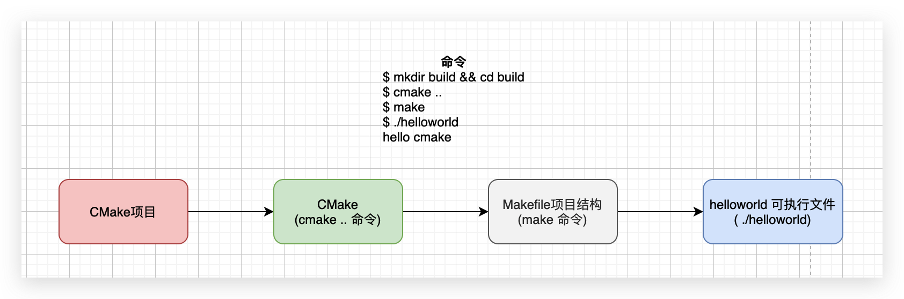

# Hello world

> Hello world 仪式:学新的东西的时候,先写一个最简单的demo运行起来

## 步骤

1. 在根目录新建`CMakeLists.txt`文件
2. 在`CMakeLists.txt`文件中添加脚本
3. 写C源代码`main.c`

`CMakeLists.txt`文件:

CMake项目的配置文件,里面写编译规则

```cmake
cmake_minimum_required(VERSION 3.12 FATAL_ERROR)
project(00helloworld)

add_executable(helloworld main.c)
```

`main.c`文件:

```c
#include <stdio.h>

int main(int argc, char* argv[]) {
    puts("hello cmake\n");
    return 0;
}
```

编译命令:

```bash
$ mkdir build && cd build
$ cmake ..
$ make
$ ./helloworld
hello cmake

```

## 解释

### `CMakeLists.txt`文件:

```cmake
# 指定最低cmake版本要求为3.12,否则就产生一个FATAL_ERROR,终止编译
cmake_minimum_required(VERSION 3.12 FATAL_ERROR)

# 指定项目名
project(00helloworld)

# 用main.c源代码文件生成helloworld程序
add_executable(helloworld main.c)
```

CMake项目的配置文件,里面写编译规则

**命令:**

上述中`cmake_minimum_required`, `project`, `add_executable`叫命令(command)

* 大小写不敏感,写成大小写都行.建议写小写(辨识度高)

> 疑问:为什么叫命令,不叫函数? 这不就是个脚本语言吗? 还有括号,和函数调用的写法一模一样.
> **写法上**和函数类似, **使用上**和命令一样, 命令的参数, 有些参数是必须的,有些是可选的. 所以,"不要看他说什么,长什么样,要看他做什么,有什么用(功能)"

**参数:**

* 大小写敏感
* 参数之间用空格区分
* 怎么写? 看[CMake文档](https://cmake.org/cmake/help/latest/index.html).

### 编译命令:

```bash
$ mkdir build && cd build
$ cmake ..
$ make
$ ./helloworld
hello cmake
```

#### 步骤:

1. 创建build目录
2. 生成build system配置
3. 执行对应build system编译命令

**1.创建build目录:**

cmake配置,编译项目会生成很多文件:

* cmake缓存,配置文件
* build system的配置文件
* 编译缓存,中间文件

**2.生成build system配置**

如何去生成build system(告诉cmake项目配置文件(CMakeLists.txt))? 生成哪个build system? 生成到哪个目录下?

* 告诉cmake项目配置文件`CMakeLists.txt`目录.(`..`表示去当前目录的上一级去找`CMakeLists.txt`文件)
* 生成哪个build system.(没有指定,使用默认,Linux下默认生成make配置,可通过`cmake --help`来查看)
* 生成到哪里去(没有指定,使用默认,当前目录(`build`目录下))

**3.执行对应build system编译命令**

上面步骤会在`build`目录生成`Makefile`文件,然后用make去编译

> 问题:make,vs或XCode的编译命令也不会用怎么办?
> 使用`cmake --build .`,这个命令是对不同build system命令的包装,内部会执行不同build sytem的编译命令

## 流程

1. 通过`cmake ..`去生成Makefile的build system配置
2. 通过`make`编译项目
3. 运行程序



## CMake命令行

安装完cmake之后的主要几个命令

* **cmake**:cmake主要程序
* ctest:测试
* cpack:打包

**help选项:**

```bash
$ cmake --help
Usage

  cmake [options] <path-to-source> # cmake ..
  cmake [options] -S <path-to-source> -B <path-to-build> # cmake -S . -B build

Options

  -S <path-to-source>          = Explicitly specify a source directory.
  -B <path-to-build>           = Explicitly specify a build directory.
  -D <var>[:<type>]=<value>    = Create or update a cmake cache entry. # cmake -D CMAKE_BUILD_TYPE=Debug ..
  -G <generator-name>          = Specify a build system generator. # cmake -G Ninja ..
  --build <dir>                = Build a CMake-generated project binary tree. # cmake --build build
  --system-information [file]  = Dump information about this system.

  --help,-help,-usage,-h,-H,/? = Print usage information and exit.
  --help-command <cmd> [<f>]   = Print help for one command and exit.
  --help-command-list [<f>]    = List commands with help available and exit.
  --help-variable var [<f>]    = Print help for one variable and exit.
  --help-variable-list [<f>]   = List variables with help available and exit.
  --help-module <mod> [<f>]    = Print help for one module and exit.
  --help-module-list [<f>]     = List modules with help available and exit.

Generators

The following generators are available on this platform (* marks default):
* Unix Makefiles               = Generates standard UNIX makefiles.
  Ninja                        = Generates build.ninja files.
  Xcode                        = Generate Xcode project files.
  ......
```


```bash
# 打印cmake帮助信息
$ cmake --help

# cmake生成build system目录,-S指定CMakeLists.txt文件目录,-B指定生成cmake配置及build system的目录(没有会创建)
$ cmake -S . -B build

# 同上,并指定生成Ninja build system项目
$ cmake -S . -B build -G Ninja

# Ninja编译命令不会用,怎么办?
# 这个命令是对不同build system命令的包装,内部调用不同build system的编译命令来编译项目
$ cmake --build build

# 显示编译详情信息,指定线程数
$ cmake --build build -v -j16
```


## 示例拓展:生成Debug版本程序

* `CMAKE_BUILD_TYPE`变量
* `set`命令
* `message`命令
* cmake命令的`-D`选项

```cmake
cmake_minimum_required(VERSION 3.12 FATAL_ERROR)
project(00helloworld)

# CMAKE_BUILD_TYPE:``Debug``, ``Release``, ``RelWithDebInfo``, ``MinSizeRel``
# CMAKE_BUILD_TYPE=Debug
set(CMAKE_BUILD_TYPE Debug)
# -DCMAKE_BUILD_TYPE=Debug

message(STATUS "WARNING:CMAKE_BUILD_TYPE = " ${CMAKE_BUILD_TYPE})

add_executable(helloworld main.c)
```

**CMAKE_BUILD_TYPE变量**:

CMAKE_XXX打头的变量是cmake内置变量,也可以自定义,后面讲. 取值看文档`cmake --help-variable CMAKE_BUILD_TYPE`,取值:空,``Debug``, ``Release``,``RelWithDebInfo``, ``MinSizeRel``.

**set命令**:

可以理解成其它编程语言中的赋值`=`等号,相关于`CMAKE_BUILD_TYPE=Debug`

**message命令**:

类似c语言中的`printf()`函数,java中的`System.out.println()`函数,可以查看一些变量的值,取变量值使用类似shell中的`${variable_name}`表达式


## 变量

https://cmake.org/cmake/help/latest/manual/cmake-variables.7.html

> 疑问:cmake里面会有很多变量,这些变量是怎么来的?

* 缺省/默认值,根据你环境自动检测得到; 比如编译器
* 根据CMakeLists.txt中的命令产生:版本号, 项目路径...
* 根据使用`cmake`命令行参数产生

**project命令**:


**常用变量**:

* CMAKE_C_COMPILER
* CMAKE_CXX_COMPILER
* CMAKE_BUILD_TYPE
* CMAKE_CURRENT_SOURCE_DIR

**查看:**

* 帮助文档`cmake --help-variable PROJECT_VERSION`
* 命令`cmake --system-information sys_info.txt`查看
* 文件`build/CMakeCache.txt`中

## 构建方式

* 外部构架(out-of-source build)👍
* 内部构建(in-source build)

cmake会去生成一堆配置,缓存文件,以及build system的配置文件,把这生成的文件放在哪里?就有了**外部构建**和**内部构建**

> 生成的上述配置是可以随意删除,不需要提交到仓库,代价就是重新编译

**外部构建**:就是把上述生成的文件放在独立的目录,比如前面提到的build目录,

**内部构建**:把上述生成的文件和源代码混合在一起,(不方便管理)

