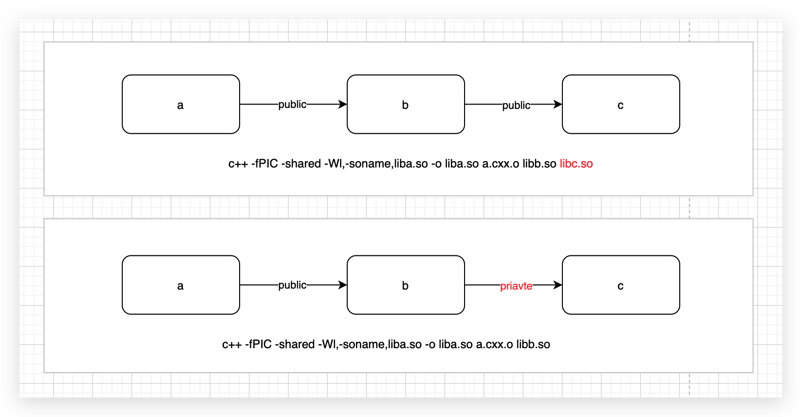

# Target

## CMake构建规则:

取自`cmake --system-information sys_info.txt`产生的文件中:

```make
// build rules
CMAKE_C_COMPILE_OBJECT == "<CMAKE_C_COMPILER> <DEFINES> <INCLUDES> <FLAGS> -o <OBJECT> -c <SOURCE>"
CMAKE_C_LINK_EXECUTABLE == "<CMAKE_C_COMPILER> <FLAGS> <CMAKE_C_LINK_FLAGS> <LINK_FLAGS> <OBJECTS> -o <TARGET> <LINK_LIBRARIES>"
CMAKE_C_CREATE_SHARED_LIBRARY == "<CMAKE_C_COMPILER> <LANGUAGE_COMPILE_FLAGS> <CMAKE_SHARED_LIBRARY_CREATE_C_FLAGS> <LINK_FLAGS> -o <TARGET> <SONAME_FLAG> <TARGET_INSTALLNAME_DIR><TARGET_SONAME> <OBJECTS> <LINK_LIBRARIES>"
```

Makefile项目的两个重要编译流程:

```bash
# 1.CMAKE_C_COMPILE_OBJECT 预处理/编译/汇编
# <CMAKE_C_COMPILER> <DEFINES> <INCLUDES> <FLAGS> -o <OBJECT> -c <SOURCE>
gcc -o main.c.o -c main.c

# 2.CMAKE_C_LINK_EXECUTABLE 链接
# <CMAKE_C_COMPILER> <FLAGS> <CMAKE_C_LINK_FLAGS> <LINK_FLAGS> <OBJECTS> -o <TARGET> <LINK_LIBRARIES>
gcc main.c.o -o main
```

## Target目标

> everything is a (self-contained) target

build system构建的目标为了产生**可执行程序**,**动态库**,**静态库**...... 这些被成为**目标target**.

### 产生这个target需要哪些条件?

* 源代码文件
* 头文件搜索路径(默认/相对路径/三方库)
* 编译器/链接器选项
* 编译器/链接器特性
* 链接库

### 类似面向对象思想,创建target(对象)

构造函数：

- add_executable() 生成可执行文件
- add_library() 生成库(动态库/静态库)

成员函数：

- target_sources() 编译源文件
- target_include_directories() 头文件路径
- target_compile_definitions() 编译器传参
- target_compile_features() 编译特性`cxx_lambdas/cxx_range_for/...`
- target_compile_options() 编译选项
- target_link_libraries() 链接库
- target_link_options() 链接选项
- target_link_directories() 链接库的目录
- get_target_property()
- set_target_properties()

成员变量

- [Target properties（太多）](https://cmake.org/cmake/help/latest/manual/cmake-properties.7.html#id4)


### 不建议使用的命令

这些是全局的命令.避免一些target的选项,配置冲突,产生一些不符合预期的行为

* add_compile_options()
* add_definitions()
* include_directories()
* link_directories()
* link_libraries()


### [Transitive Usage Requirements](https://cmake.org/cmake/help/v3.0/manual/cmake-buildsystem.7.html#transitive-usage-requirements)

**问题**:

当项目增长,依赖增多,面临的问题:多层依赖时,(库/编译flag/option)可见性/传递性的问题

**大型项目依赖关系图:**


> 分析问题,分析最简单的模型就够了,复杂的都是简单的组合形成的

#### 例子1:库依赖`PUBLIC`/`PRIVATE`

```cmake
# PUBLIC
## c++ -fPIC -shared -Wl,-soname,liba.so -o liba.so a.cxx.o libb.so libc.so
target_link_libraries(b PUBLIC c) 
target_link_libraries(a PUBLIC b)

# PRIVATE/PUBLIC
## c++ -fPIC -shared -Wl,-soname,liba.so -o liba.so a.cxx.o libb.so
target_link_libraries(b PRIVATE c) 
target_link_libraries(a PUBLIC b)
```




**输出编译命令**:

```bash
c++ -fPIC -shared -Wl,-soname,liba.so -o liba.so a.cxx.o libb.so libc.so
c++ -fPIC -shared -Wl,-soname,liba.so -o liba.so a.cxx.o libb.so
```

#### 例子2:编程传参`INTERFACE`

```cmake
# archive库
add_library(archive archive.cpp)
target_compile_definitions(archive INTERFACE USING_ARCHIVE_LIB)

# serialization库
add_library(serialization serialization.cpp)
target_compile_definitions(serialization INTERFACE USING_SERIALIZATION_LIB)

# archiveExtras库
add_library(archiveExtras extras.cpp)
target_link_libraries(archiveExtras PUBLIC archive)
target_link_libraries(archiveExtras PRIVATE serialization)
## archiveExtras 被编译同时带 -DUSING_ARCHIVE_LIB -DUSING_SERIALIZATION_LIB

# consumer程序
add_executable(consumer consumer.cpp)
## consumer is compiled with -DUSING_ARCHIVE_LIB
target_link_libraries(consumer archiveExtras)
```

**输出编译命令:**

```bash
c++ -o serialization.o -c serialization.cpp
c++ -o archive.o -c archive.cpp
c++ -DUSING_ARCHIVE_LIB -DUSING_SERIALIZATION_LIB -o extras.o -c extras.cpp

c++ -DUSING_ARCHIVE_LIB -o consumer.o -c consumer.cpp
c++ -o consumer libarchiveExtras.a libarchive.a libserialization.a
```

#### `PRIVATE/INTERFACE/PUBLIC`规则

* `PRIVATE`:只给自己用,不给依赖者用
* `INTERFACE`:自己不用,给依赖者用(当依赖于纯头文件库时,在 add_library() 中使 用`INTERFACE`就非常有有用了)
* `PUBLIC`:`PRIVATE` + `INTERFACE`自己和依赖者都可以用
* $<BUILD_INTERFACE>: Used by consumers from this project or use the build directory
* $<INSTALL_INTERFACE>: Used by consumers after this target has been installed


## CMake中的参数传递

如何通过cmake命令去影响编译哪些代码

1. cmake命令参数 --> CMakeLists.txt
2. CMakeLists.txt --> C/CXX代码中

### 1. cmake命令参数传递到CMakeLists.txt文件中

```bash
$ cmake --help

Options
  -D <var>[:<type>]=<value>    = Create or update a cmake cache entry. # cmake -D CMAKE_BUILD_TYPE=Debug ..
```

### 2. CMakeLists.txt --> C/CXX代码中

示例: 通过cmake命令行去控制代码中的日志级别

```c
#include <stdio.h>
#include <stdlib.h>
#include <string.h>
#include "log.h"
#include "config.h"

// cmake -S . -B build -D LOG_DEBUG_ENABLE=ON # 控制当前log级别
int main(int argc, char* argv[]) {
#ifdef LOG_DEBUG_ENABLE
    log_set_level(LOG_DEBUG);
#else
    log_set_level(LOG_WARN);
#endif

    log_trace("trace");
    log_debug("debug");
    log_info("info");
    log_warn("warn");
    log_error("error");
    return 0;
}
```

流程: cmake命令行 --> CMakeLists.txt --> 生成头文件 --> C/CXX代码

`configfile命令`:通过input文件生成output(头文件), 并且可以把cmake中的变量写入到output中;input文件一般用`in`后缀,表示input

```cmake
cmake_minimum_required(VERSION 3.12 FATAL_ERROR)

project(04arguments)

add_library(log STATIC
    log.c
)

add_executable(arguments
    main.c
)

# configure_file(<input> <output>)
configure_file(
    ${CMAKE_CURRENT_SOURCE_DIR}/config.h.in
    ${CMAKE_CURRENT_SOURCE_DIR}/config.h
)

target_link_libraries(arguments PRIVATE log)
target_include_directories(arguments PRIVATE ${log_SOURCE_DIR})
```

cmake中的变量写入到output中?

关键字语法:

* `#cmakedefine`语法
* `#cmakedefine01`语法

```c
// #cmakedefine语法
#cmakedefine LOG_DEBUG_ENABLE
// 不存在: /* #undef LOG_DEBUG_ENABLE */
// 存在: #define LOG_DEBUG_ENABLE

#cmakedefine LOG_DEBUG_ENABLE ${LOG_DEBUG_ENABLE}
// 不存在: /* #undef LOG_DEBUG_ENABLE */
// 存在: #define LOG_DEBUG_ENABLE ON

// #cmakedefine01语法
#cmakedefine01 LOG_DEBUG_ENABLE
// 不存在: #define LOG_DEBUG_ENABLE 0
// 存在: #define LOG_DEBUG_ENABLE 1
```

config.h.in文件

```cmake
#cmakedefine LOG_DEBUG_ENABLE
```

编译命令:

```makefile
normal:
	cmake -S . -B build
	cmake --build build
	./build/arguments

debug:
	cmake -S . -B build -D LOG_DEBUG_ENABLE=ON
	cmake --build build
	./build/arguments
```


**[add_library](dfile:///Users/shibin/Library/Application Support/Dash/DocSets/CMake/CMake.docset/Contents/Resources/Documents/cmake.org/cmake/help/v3.20/command/add_library.html#add-library)**

  - [Normal Libraries](dfile:///Users/shibin/Library/Application Support/Dash/DocSets/CMake/CMake.docset/Contents/Resources/Documents/cmake.org/cmake/help/v3.20/command/add_library.html#normal-libraries)
  - [Object Libraries](dfile:///Users/shibin/Library/Application Support/Dash/DocSets/CMake/CMake.docset/Contents/Resources/Documents/cmake.org/cmake/help/v3.20/command/add_library.html#object-libraries)
  - [Interface Libraries](dfile:///Users/shibin/Library/Application Support/Dash/DocSets/CMake/CMake.docset/Contents/Resources/Documents/cmake.org/cmake/help/v3.20/command/add_library.html#interface-libraries)
  - [Imported Libraries](dfile:///Users/shibin/Library/Application Support/Dash/DocSets/CMake/CMake.docset/Contents/Resources/Documents/cmake.org/cmake/help/v3.20/command/add_library.html#imported-libraries)
  - [Alias Libraries](dfile:///Users/shibin/Library/Application Support/Dash/DocSets/CMake/CMake.docset/Contents/Resources/Documents/cmake.org/cmake/help/v3.20/command/add_library.html#alias-libraries)

### 生成器表达式

todo

- Generator expressions use the $<> syntax.

- Not evaluated by command interpreter.

  It is just a string with $<>.

- Evaluated during build system generation.

- Not supported in all commands (obviously).

生成器表达式是CMake 在生成时(即配置之后)构造, 用于生成特定于配置的构建输出

https://cmake.org/cmake/help/latest/manual/cmake-generator-expressions.7.html