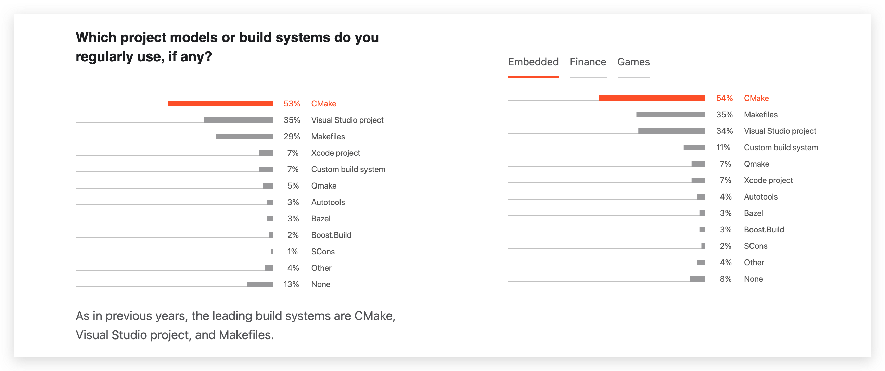

# CMake教程

## 简介

官网:https://cmake.org/

> CMake is an open-source, cross-platform family of tools designed to build, test and package software. CMake is used to control the software compilation process using simple platform and **compiler independent configuration files**, and **generate native makefiles** and workspaces that can be used in the compiler environment of your choice.

开源,跨平台的**构建,测试,打包**软件工具,
使用简单平台和独立于编译器的**配置文件**来控制软件编译过程，生成可在您选择的编译器环境中使用的本机makefile和工作区

**画重点**

* 构建
* 测试
* 打包
* cmake命令及语法

## CMake设计的目标

> 提供一组工具，可以在不同平台上配置、构建、测试和部署项目. https://www.aosabook.org/en/cmake.html

CMake是一个**构建生成器**(build system **generator**), 不是build system，提供了强大的领域特定语言(**DSL**)来描述构建系统应该实现的功能

<!-- todo -->

## Jetbrain 2020调查

* c:https://www.jetbrains.com/lp/devecosystem-2020/c/
* cpp:https://www.jetbrains.com/lp/devecosystem-2020/cpp/

**CPP:**

## 学习步骤:

**官方文档教程存在的问题:**

* CMake的[官方文档](https://cmake.org/cmake/help/latest/index.html)更像是个手册,方便查询的那种;
* 官方教程[CMake Tutorial](https://cmake.org/cmake/help/latest/guide/tutorial/index.html), 学习步骤顺序没有问题;问题是内容精简得,里面很多概念不会跟你解释

### 本教程步骤:

> 循序渐进,中间会穿插讲解很多概念

* helloworld示例
* cmake常用命令(脚本)
* 生成target(可执行程序/动态库/静态库)
* CMake的模块
* 项目引入三方库
* 交叉编译
* 安装/打包

## Reference:

### **书籍推荐:**CMake Cookbook

* CMake Cookbook英文https://www.packtpub.com/product/cmake-cookbook/9781788470711
* 中文版(Github):1.https://github.com/xiaoweiChen/CMake-Cookbook
* 中文版(书栈网):2.https://www.bookstack.cn/books/CMake-Cookbook
* 代码:https://github.com/dev-cafe/cmake-cookbook

### **视频:**

* https://www.youtube.com/watch?v=bsXLMQ6WgIk&t=2413s&ab_channel=CppNow 👍
* https://www.youtube.com/watch?v=eC9-iRN2b04&t=984s&ab_channel=CppCon
* https://www.youtube.com/watch?v=y9kSr5enrSk&t=2077s&ab_channel=MeetingCpp